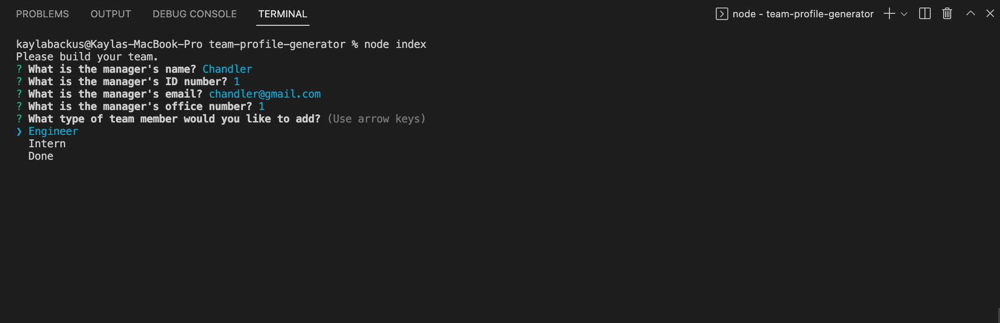
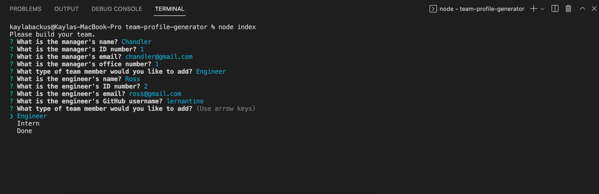
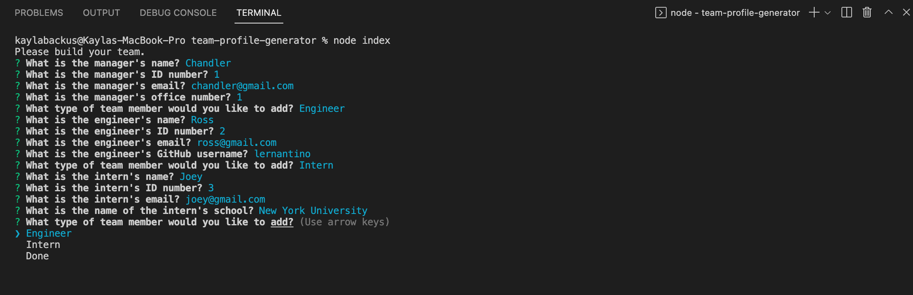
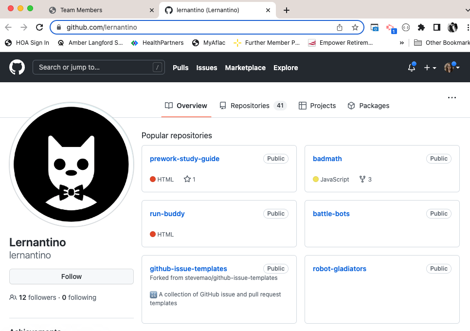

# Team Profile Generator

## Description
This is a simple team roster generator. Using the command line interface, the user answers questions about their team and an HTML file is automatically formatted with the information provided.

To view a walkthrough video, [click here]().

## Table of Contents
- [Installation](#installation)
- [Usage](#usage)
- [License](#license)
- [Credits](#credits)

## Installation
In order to install this project, the user must have Node.js installed on their local machine. [Click here](https://nodejs.org/en/download/) to download the LTS version Node.js for Windows (x64). [Click here](https://nodejs.org/en/download/) to download the LTS version of Node.js for macOS.
  
Then, the user can clone the repository from GitHub using the command <samp>git clone git@github.com:kaylab78/team-profile-generator.git</samp> in their CLI. 

The user must install the [npm inquirer package](https://www.npmjs.com/package/inquirer). In the CLI, type the command <samp>npm install inquirer</samp>. 

The [Jest](https://jestjs.io/docs/getting-started) framework is used in this project to run the tests in the code. To install Jest, type <samp>npm install jest --save-dev</samp> in the CLI.

## Usage
After the user installs the project and necessary packages to execute the functions, the user types <samp>node index</samp> in their CLI to begin answering the questions for the README file.

They are presented with a set of questions in their CLI. The answers that the user gives to these questions will be automatically written to a formatted HTML file.

The user is first asked questions in regard to the team manager. All of the questions require answers. The questions that the user is asked for the manager are:
- What is the manager's name?
- What is the manager's ID number?
- What is the manager's email?
- What is the manager's office number?

The user is then prompted to either pick a new team member or be done with their team.

When the user chooses to add an Engineer to their team, they are asked:
- What is the engineer's name?
- What is the engineer's ID number?
- What is the engineer's email?
- What is the engineer's GitHub username?

When the user chooses to add an Intern to their team, they are asked:
- What is the intern's name?
- What is the intern's ID number?
- What is the intern's email?
- What is the name of the intern's school?

When the user chooses to be done creating their team, an HTML file is automatically created and formatted.

When the user clicks on the team member's email, their preferred email client opens up a new email message with the email address in the "to" field. When the user clicks on the engineer's GitHub username, a new tab opens with their GitHub profile.

## License
&copy; 2022 by Kayla Backus

This project is licensed under the MIT license.

[License: MIT License](https://opensource.org/licenses/MIT)

## Credits
Wallace, Nicole. (2020, May 17). Team-profile-generator. GitHub. [https://github.com/nicolewallace09/team-profile-generator/blob/master/__tests__/Employee.test.js](https://github.com/nicolewallace09/team-profile-generator/blob/master/__tests__/Employee.test.js).

[Inquirer.js](https://www.npmjs.com/package/inquirer)

[Jest.js](https://www.npmjs.com/package/jest)

[Node.js](https://nodejs.org/en/)